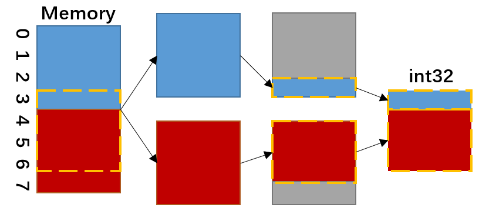

## 内存对齐

### 什么是内存对齐？

首先给出一个结构体。

```go
type ex1 struct {
    x int32
    y byte
}

func main() {
    s1 := ex1{}
    fmt.Printf("ex1 size: %d\n", unsafe.Sizeof(s1))
}
```

理论上，x占4字节，y占1字节，那么整个结构体的大小应该为4+1=5字节。然而，在32位机器上，上面程序的输出结果却为8字节，这就是**内存对齐**导致的。

计算机的内存空间是按字节划分的，从理论上讲对任何变量的访问应该都可以从任意的起始地址开始，然而实际上计算机对基本类型数据在内存中的存放有限制，它们会要求这些数据的首地址的值是某个数的倍数，这就是所谓的内存对齐。

<br>

### 为什么要内存对齐？

内存空间以字节为基本单位，但实际上CPU并不会以单字节的方式读写内存，相反CPU是通过块进行读取的，块的大小可以为4、8、16，甚至是32等字节。块的大小被称为**内存访问粒度**。

在32位机器下，内存访问粒度为4字节，此时CPU从内存读取数据的步长为4，即只能从地址为4的倍数的内存开始读取数据（0,4,8,12,...）；在64位机器下，内存访问粒度通常为8字节。

假如没有内存对齐机制，数据可以任意存放。现在考虑在32位机器下，一个int32变量存放在地址为3的内存中，那么CPU在读取这个变量时，就必须进行两次存取：

1. CPU**首次**从0地址读取第一个字节块；
2. 删除前3个字节的内容；
3. CPU**再次**从4地址读取第二个字节块；
4. 删除最后一个字节的内容；
5. 将保留的两块数据进行合并，得到最终的读取结果。



从上面的过程可以看出，若访问未对齐的内存，将会导致CPU进行两次内存访问，并且要花费额外的时钟周期来处理对齐及运算，从而导致性能低下。

如果有了内存对齐，那么上述操作仅需要一次访问就可以完成整个读取操作，这是典型的**空间换时间**做法。

<br>

### 对齐规则

首先需要明确两个概念：

**对齐系数** ：不同平台的编译器都有自己默认的对齐系数，正如前面提到的，32位机器一般默认的对齐系数为4，64位的通常为8。

- 在C++中，通过预编译命令 **#param pack(n)** 设置对齐系数。

**有效对齐值** ：有效对齐值也叫**对齐单位**，它的值通过 **min( 对齐系数, 结构体中所占字节最多的成员变量 )** 来确定。

具体规则：

1. 对于结构体中的每个成员，它的起始内存地址（即**偏移量**）必须为**k = min( 有效对齐值, 当前成员的类型长度 )**的**整数倍**，如有需要编译器会自动在成员之间填充字节。特别地，对于结构体中的第一个成员，它的偏移量为0。
2. 结构体的**总大小**必须为**有效对齐值**的**最小整数倍**，如有需要编译器会自动在最后一个成员的后面填充字节。

**先内部对齐，再整体对齐。**


### 几个实例(基于C++和Go)

1. 32位机器下，对齐系数默认为4，x1，x2，x3的有效对齐值均为 min(4, 4) = 4：

   ```c++
   struct {
       int i;
       char c1;
       char c2;
   }x1;
   
   struct {
       char c1;
       int i;
       char c2;
   }x2;
   
   struct {
       char c1;
       char c2;
       int i;
   }x3;
   ```

   - 对于x1，i占4个字节，它的偏移量为0，k = 4，满足规则1，不进行对齐；c1的偏移量为4，占1个字节，k = 1，满足规则1，同样不进行对齐；c2的偏移量为5，同样满足规则1；此时x1大小为4+1+1=6，不满足规则2，编译器自动填充2个字节，因此总字节为8。
   - 对于x2，c1偏移量为0，满足规则1；i偏移量为1，不满足规则1，编译器在c1后自动填充3个字节使i的偏移量为4,；c2偏移量为8，满足规则1；此时x2大小为1+3+4+1=9，不满足规则2，编译器自动填充填充3个字节，因此总字节为12。
   - 对于x3，c1和c2均满足规则1；i偏移量为2，不满足规则1，编译器在c2后填充2个字节使i的偏移量变为4；此时x3大小为1+1+2+4=8，满足规则2，因此总字节为8。

<br>

2. 64位机器下，对齐系数默认为8，part1，part2的有效对齐值为 min(8, 8) = 8:

   ```go
   type part1 struct {
       a bool
       b int 32
       c int8
       d int64
       e byte
   }
   
   type part2 struct {
       e byte
       c int8
       a bool
       b int32
       d int64
   }
   ```

   - 对于part1，a占1个字节，偏移量为0，k=1；b占4个字节，偏移量为1，k=4，需对齐到4；c占1个字节，偏移量为8；d占8个字节，偏移量为9，k=8，需对齐到16，e占1个字节，偏移量为17，k=1；此时part1大小为1+3+4+1+7+8+1=25，不满足规则2，编译器填充7个字节，因此总字节为32。
   - 对于part2，e偏移量为0；c偏移量为1；a偏移量为2；b偏移量为3，k=4，需对齐到4；d偏移量为8；此时part2大小为1+1+1+1+4+8=16，满足规则2，因此总字节为16。

   特别地，通过实例2可以看出，仅通过调整结构体内成员变量的字段顺序，就能达到缩小结构体所占的内存空间。